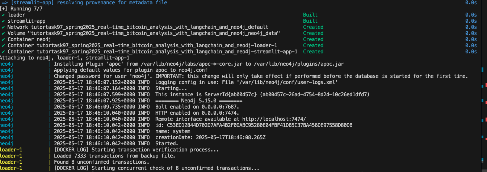
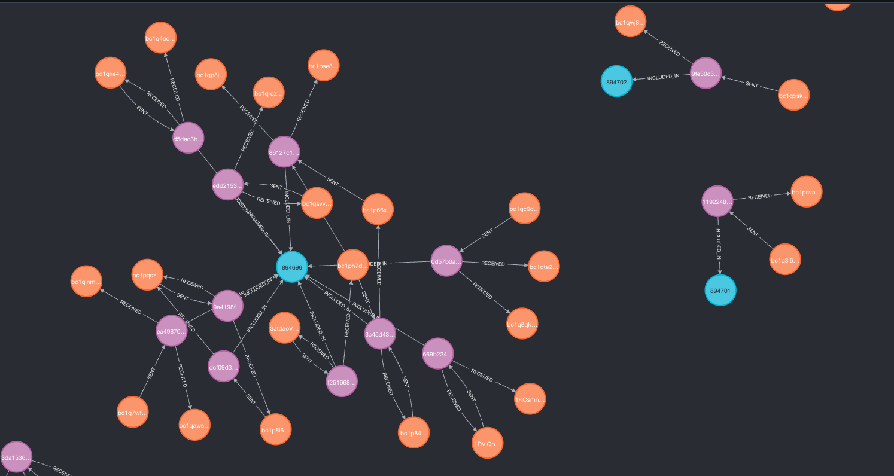
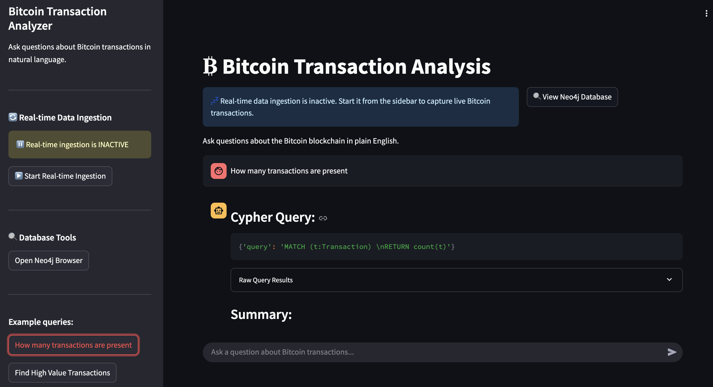
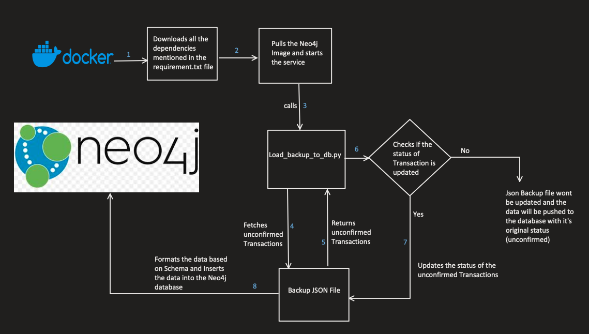
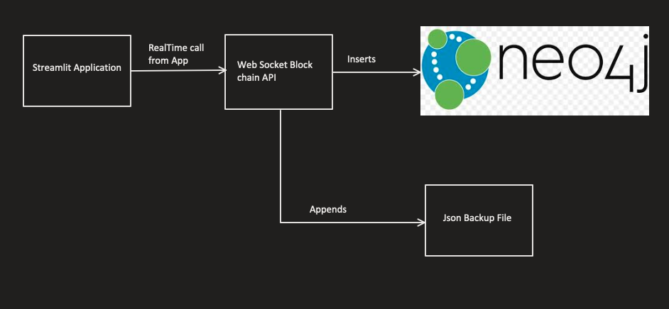
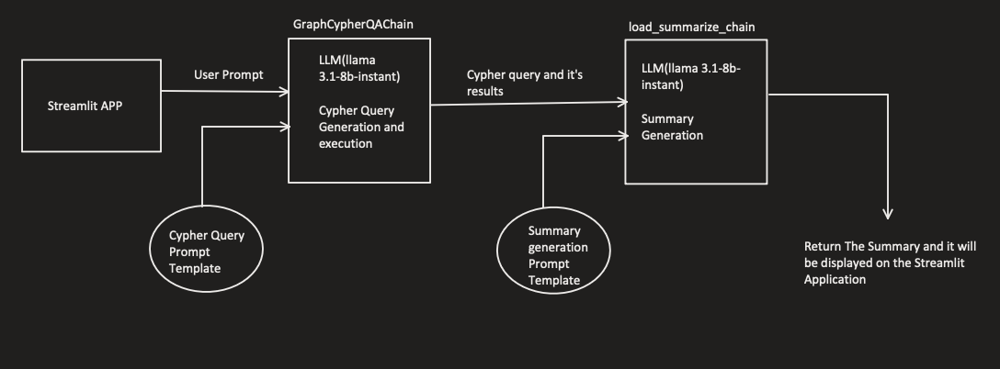

# Real-time Bitcoin Analysis with Langchain and_Neo4j
# Project Overview

Creating a real time bitcoin transaction analysis system which ingests live bitcoin transaction data and stores it in a graph database, later uses large language models (LLMs) to generate valuable insights about transaction patterns and network anomalies.

## Key features include:
- Real-time data ingestion from Bitcoin blockchain
- Graph-based storage of transactions, blocks, and wallet relationships
- NLP-powered summarization and trend prediction
- Interactive Streamlit chatbot for natural language queries

# Technology used
## Neo4j
- Neo4j is a graph database system that organizes data using a property graph model, representing information as nodes and their connections (relationships). Instead of using tables and foreign keys like traditional relational databases, Neo4j structures data in a way that makes it easier and faster to navigate complex, interconnected information.
Useful for this project for the following reasons:
    - Natural Fit for Blockchain : Blockchain inherently consists of interconnected data — transactions linked to wallets, which are included in blocks. Representing this as a graph (nodes and relationships) allows intuitive modeling.
    - Real-Time Ingestion & Visualization: As new transactions stream in, they are immediately inserted into the graph, allowing live monitoring of the network structure

## Langchain
- LangChain is an open-source framework designed to help developers create applications using Large Language Models (LLMs) like GPT,llama etc. It offers tools and interfaces that make it easy to connect LLMs to different data sources, enabling the development of features such as chatbots, document summarization, and code interpretation.
Useful for this project for the following reasons:
    - Natural Language to Cypher:User prompts converted to cypher
    - LLM based Summarization:Once the query runs, Langchain + LLM can summarize the results in plain English — highlighting patterns, unusual spikes, or insights that might not be obvious.

# Setup & Dependencies
## Requirements
- Docker 20.10+
- Docker Compose 2.20+
- Python 3.10+
- These are my system specs : 
    - Docker Compose version v2.34.0-desktop.1
    - Docker version 28.0.4
    - Python 3.12.5

## Environment Setup
- Create `.env` file:
- add these variables in the file:
    GROQ_API_KEY='you-groq-api-key'
    
    NEO4J_USERNAME = 'your username' 
    
    NEO4J_PASSWORD = 'your password'

## Usage
- Clone the repo using this command: 'git clone https://github.com/causify-ai/tutorials.git'
- navigate to this location in the terminal - tutorials/DATA605/Spring2025/projects/TutorTask97_Spring2025_Real-time_Bitcoin_Analysis_with_Langchain_and_Neo4j.
- Ensure that docker is running.
- Remove all the containers and volumes that are present in desktop just to ensure that nothing breaks by running the command:'docker-compose down -v'
- Now run docker-compose up --build for building and running the application through docker.
- Below is a sample image of a successful build :

Once the build is complete you can access the chatbot application and the neo4j database locally. 

- For accessing the chatbot application - http://0.0.0.0:8501 or http://localhost:8501/
- For accessing the neo4j data base - http://localhost:7474/browser/

Note - There is an option in the chatbot application through which you can open the neo4j database.

Note - The build might take around 5-7 minutes if you are running for the first time.

# Files Used:
- graph_utils.py : graph related queries and functionalities
- app.py : Launching the application(contains LLM related code also)
- config.py - for credentials
- load_backup_to_db.py : loads backup json data to neo4j database
- llm_prompt_templates - for generating prompt templates
- requirements.txt - for managing all the dependencies
- realTimeDataIngestion.py - for realtime ingestion
- bitcoin_transactions_backup - backup json file
- docker and docker-compose.yml
- .env file

# Data Collection API
- The real-time bitcoin transaction data is collected with the help of an API and websocket library in python
- The websocket url used is -  "wss://ws.blockchain.info/inv"
Note - You cannot directly access the websocket url from the browser as you do with the other urls. You need to write a script in python or javascript to access it. 
You can use the below link to view the latest transactions
- This is blockstream website where the latest transactions can be seen- https://blockstream.info/tx/recent

# Neo4j Graph database schema
- The real-time data collected from the websocket API is ingested into the Neo4j database. The schema of the database is mentioned below - 
### Nodes
- **Transaction**
- `txid` (String, Primary Key)
- `value` (Integer, satoshi)
- `fee` (Integer, satoshi)
- `status` (Json, nested map with keys like confirmed,block height,hash,time)

- **Block**
- `height` (Integer, Primary Key)
- `hash` (String,Unique hash for a block)

- **Wallet**
- `address` (String, Primary Key)

### Relationships
- `(Transaction)-[:INCLUDED_IN]->(Block)`
- `(Wallet)-[:SENT]->(Transaction)`
- `(Transaction)-[:RECEIVED]->(Wallet)`

Below is the sample screenshot of the ingested data into the neo4j graph database -

The Blue nodes represent blocks,
the pink nodes represent transactions and 
the orange nodes represent the wallets.

# Chat Bot for NLP anlaysis
The chat bot performs the following tasks:  
1. Natural Language Understanding
2. Query Generation and Execution
3. Real-time data retrieval
4. LLM based Summarization and Analysis

- The chatbot is embedded in the streamlit application which provides an interactive chat interface. 
- Users see both the generated Cypher query and the summarized results, enhancing transparency and trust in the system. 

LLM used: llama-3.1-8b-instant

- The LLM is used through the groq API key. 

Below is the snapshot of the chatbot application: 

# Design Flow

### Part 1 - Loading data to the Graph database on Build

### Part 2 - Design flow for Real Time Ingestion through Streamlit Application

### Part 3 - Design Flow for Summary generation through Streamlit Application
